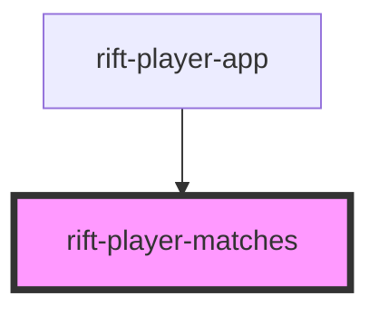

# rift-player-matches

<!-- Auto Generated Below -->

## Properties

| Property       | Attribute | Description                                                  | Type           | Default     |
| -------------- | --------- | ------------------------------------------------------------ | -------------- | ----------- |
| `matchHistory` | --        | Match history. Renders a skeleton table when not yet loaded. | `MatchEntry[]` | `undefined` |

## Dependencies

### Used by

 - [rift-player-app](../rift-player-app)

### Graph

----------------------------------------------

*Built with [StencilJS](https://stenciljs.com/)*
